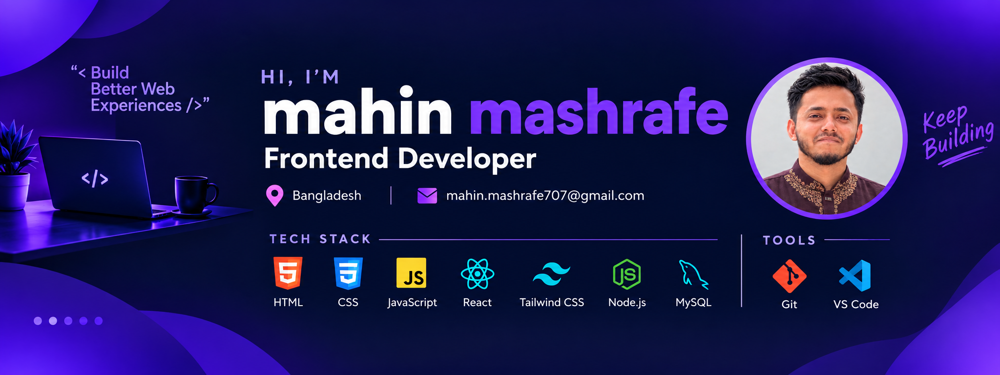

<p align="center">
  
</p>

<!-- ========================================================= -->
<!--                        INTRO                              -->
<!-- ========================================================= -->

<h1 align="center">Hi 👋, I'm Mahin MASHRAFE</h1>

<p align="center">
  <strong>Frontend Developer</strong> • Bangladesh
</p>

<p align="center">
  I build modern, responsive and user-friendly web experiences
  while continuously learning and improving my development skills.
</p>

<p align="center">
  <a href="https://github.com/Mashrafe313">
    
  </a>
  <a href="https://www.linkedin.com/in/mashrafe313">
    
  </a>
  <a href="mailto:mahin.mashrafe707@gmail.com">
    
  </a>
</p>

---


## 👨‍💻 About Me

I'm **Mahin MASHRAFE**, a Frontend Developer from **Bangladesh**.

I enjoy turning ideas and designs into responsive websites and web applications. I'm focused on writing clean code, creating user-friendly interfaces, and continuously improving my development skills.

### 🚀 Currently

- 🌱 Improving my JavaScript and React skills
- ⚛️ Building projects with React
- 🎨 Creating responsive interfaces with Tailwind CSS
- 🧩 Exploring modern frontend development
- 🔧 Learning more about Node.js and backend development
- 🚀 Building real-world projects
- 📚 Continuously learning new technologies

---


## 🛠️ Tech Stack

### 🌐 Frontend

<p>
  
</p>

### ⚙️ Backend & Database

<p>
  
</p>

### 🔧 Tools

<p>
  
</p>

---

## 💡 Technologies

| Area | Technologies |
| :--- | :--- |
| **Frontend** | HTML5, CSS3, JavaScript, React |
| **Styling** | Tailwind CSS |
| **Backend** | Node.js |
| **Database** | MySQL |
| **Version Control** | Git, GitHub |
| **Development Tool** | VS Code |

---


## 🚀 Featured Projects

### 🎤 DevConf 2026

A modern conference website designed and developed for **DevConf 2026**.

The project focuses on presenting conference information through a clean, responsive interface with dedicated sections for speakers, pricing and the hackathon.

#### ✨ Highlights

- 🎯 Hero section
- 🎤 Speakers section
- 🏷️ Speaker tracks
- 💳 Pricing plans
- 🚀 Hackathon section
- 📱 Responsive layout
- 🎨 Modern UI
- 🔗 Registration call-to-actions


#### 🌐 Live Demo

👉 [View DevConf 2026](https://mashrafe313.github.io/PH_assignment-1_DevConf2026/)

#### 💻 Source Code

👉 [View Repository](https://github.com/Mashrafe313/PH_assignment-1_DevConf2026)

---

### 💻 DevStack

A developer-focused web project created as part of my web development journey.

The project explores modern interface design and practical frontend development.

#### ✨ Highlights

- 🖥️ Modern user interface
- 📱 Responsive design
- 🎨 Clean visual design
- 🧩 Interactive web experience
- 🚀 Practical frontend project


> Update the technologies above if the actual DevStack repository uses a different stack.

#### 🌐 Live Demo

👉 [View DevStack](https://dev-stack-2.netlify.app/)

#### 💻 Source Code

👉 [View Repository](https://github.com/mashrafe313/DevStack.git)

---


## 🎯 What I Focus On

```text
┌─────────────────────────────────────────────────┐
│                                                 │
│   🎨 Clean UI                                   │
│   📱 Responsive Design                          │
│   ⚡ Performance                                │
│   🧩 Reusable Components                        │
│   🧠 Problem Solving                            │
│   📚 Continuous Learning                        │
│                                                 │
└─────────────────────────────────────────────────┘
